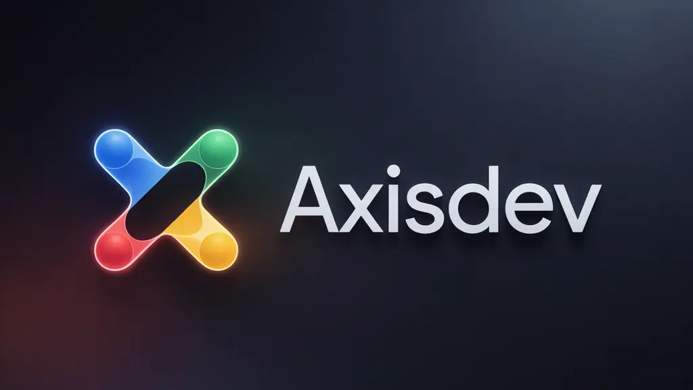
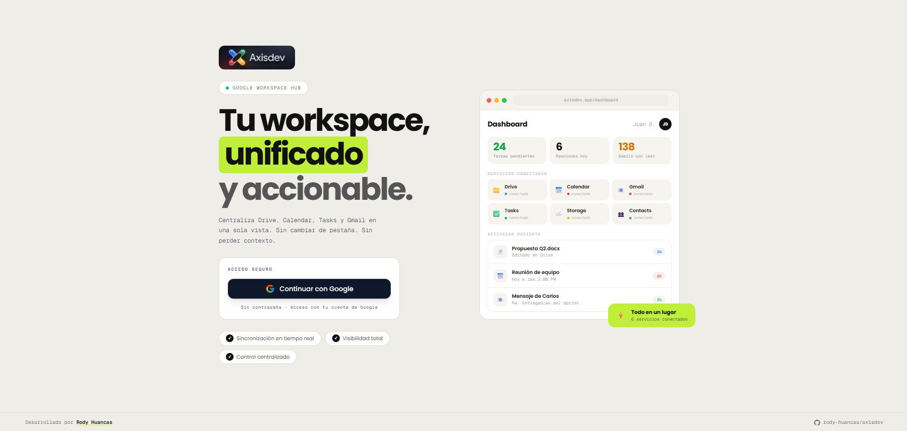
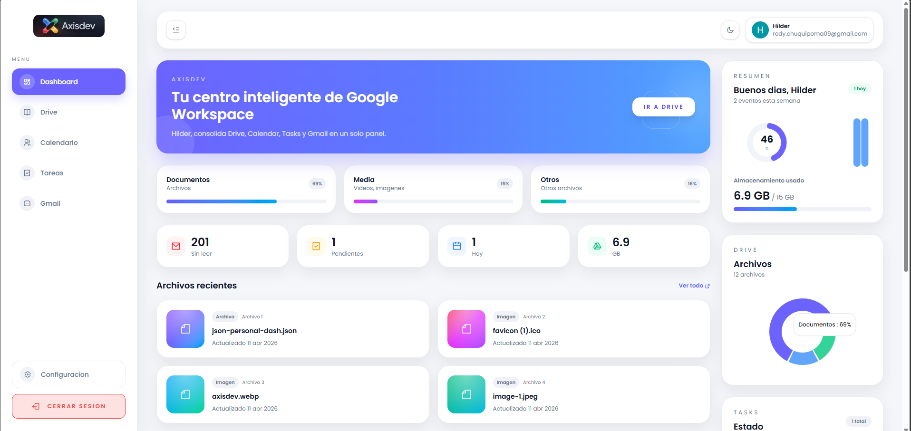

<div align="center">
  

  <br />
  <br />

  <p>
    <strong>Tu centro de mando para Google Workspace.</strong><br/>
    Consolida Drive, Calendar, Gmail y Tasks en una sola interfaz — sin cambiar de pestaña, sin perder contexto.
  </p>

  <br />


  <br />
  <br />

</div>

---

## Vista previa

| Landing                        |
| ------------------------------ |
|  |

| Dashboard                          |
| ---------------------------------- |
|  |

---

## ¿Qué es AxisDev?

AxisDev es un panel de control que actúa como una **capa superior sobre Google Workspace**. Su objetivo es eliminar la fatiga de pestañas, permitiendo que desarrolladores y profesionales gestionen su información de un vistazo — sin saltar entre aplicaciones.

> _"El centro de mando para tu Google Workspace: convierte el desorden de múltiples pestañas en una sola interfaz inteligente, accionable y de alto rendimiento."_

---

## Funcionalidades

- **📁 Explorador de Drive** — Acceso rápido a documentos recientes y estructura de carpetas
- **📅 Agenda consolidada** — Visualización de eventos y reuniones del día desde Google Calendar
- **📧 Centro de mensajes** — Notificaciones y lectura de correos pendientes de Gmail
- **✅ Gestión de Tareas** — Control de pendientes integrado desde Google Tasks
- **⚡ Sincronización en tiempo real** — Conexión directa con las APIs de Google para reflejar cambios al instante
- **🔐 Autenticación segura** — OAuth 2.0 con Auth.js, sin contraseñas

---

## Stack Tecnológico

| Categoría       | Tecnología                     |
| --------------- | ------------------------------ |
| Framework       | Next.js 16 (App Router)        |
| Lenguaje        | TypeScript                     |
| Estilos         | Tailwind CSS v4                |
| Autenticación   | Auth.js (NextAuth) + OAuth 2.0 |
| Base de datos   | Supabase                       |
| Estado          | Zustand                        |
| Formularios     | React Hook Form + Zod          |
| Gráficos        | Recharts                       |
| Calendario      | React Big Calendar             |
| Package manager | pnpm                           |

---

## Instalación y uso local

### Prerrequisitos

- Node.js 18+
- pnpm
- Cuenta de Google con acceso a la [Google Cloud Console](https://console.cloud.google.com/)
- Proyecto en [Supabase](https://supabase.com/)

### 1. Clona el repositorio

```bash
git clone https://github.com/rody-huancas/axisdev.git
cd axisdev
```

### 2. Instala las dependencias

```bash
pnpm install
```

### 3. Configura las variables de entorno

```bash
cp .env.example .env.local
```

Completa las variables en `.env.local`:

```env
# Auth.js
AUTH_SECRET=

# Google OAuth
AUTH_GOOGLE_ID=
AUTH_GOOGLE_SECRET=

# Google APIs
GOOGLE_CLIENT_ID=
GOOGLE_CLIENT_SECRET=
GOOGLE_REDIRECT_URI=

# Supabase
NEXT_PUBLIC_SUPABASE_URL=
NEXT_PUBLIC_SUPABASE_ANON_KEY=
```

### 4. Configura Google Cloud

1. Ve a [console.cloud.google.com](https://console.cloud.google.com/)
2. Crea un proyecto nuevo o selecciona uno existente
3. Habilita las siguientes APIs:
   - Google Drive API
   - Google Calendar API
   - Gmail API
   - Google Tasks API
4. Crea credenciales OAuth 2.0 y agrega `http://localhost:3000` como origen autorizado
5. Copia el **Client ID** y **Client Secret** en tu `.env.local`

### 5. Inicia el servidor de desarrollo

```bash
pnpm dev
```

Abre [http://localhost:3000](http://localhost:3000) en tu navegador.

---

## Estructura del proyecto

```
axisdev/
├── actions/          # Server Actions (Next.js)
├── app/              # Rutas y layouts (App Router)
├── components/       # Componentes UI reutilizables
│   └── shared/       # Componentes globales
├── lib/              # Configuración y utilidades
├── public/           # Assets estáticos
├── services/         # Llamadas a las APIs de Google
├── styles/           # Estilos globales
├── types/            # Tipos TypeScript
├── utils/            # Funciones auxiliares
├── auth.ts           # Configuración de Auth.js
└── .env.example      # Variables de entorno de ejemplo
```

---

## Licencia

MIT © [Rody Huancas](https://rody-huancas.vercel.app/)
